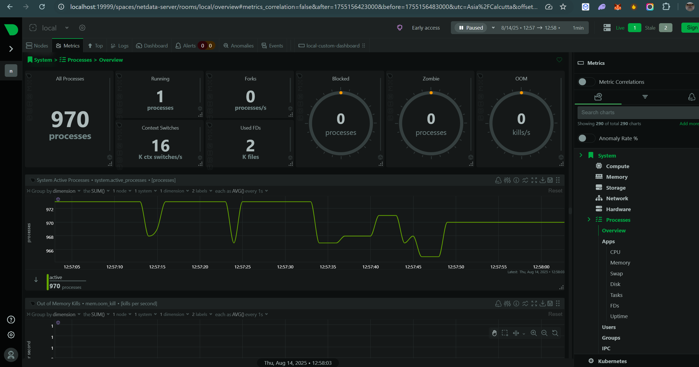
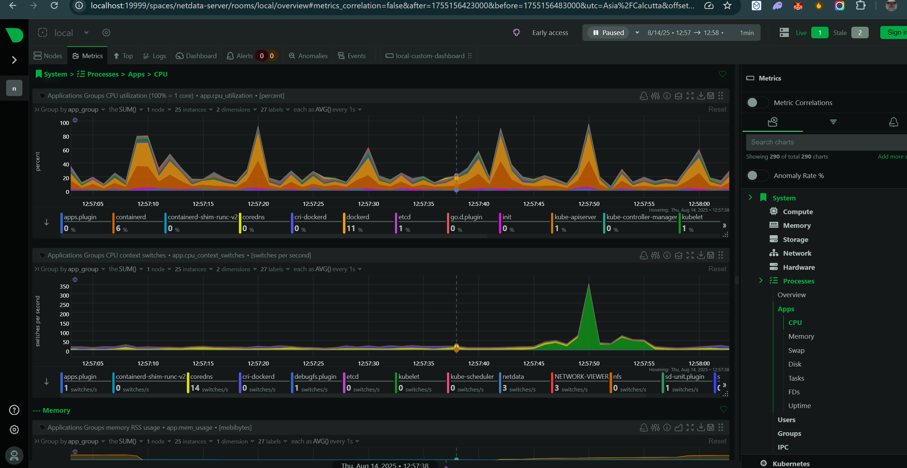
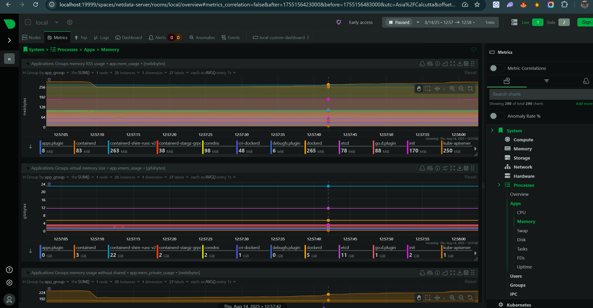
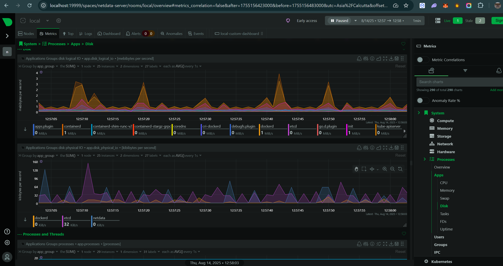
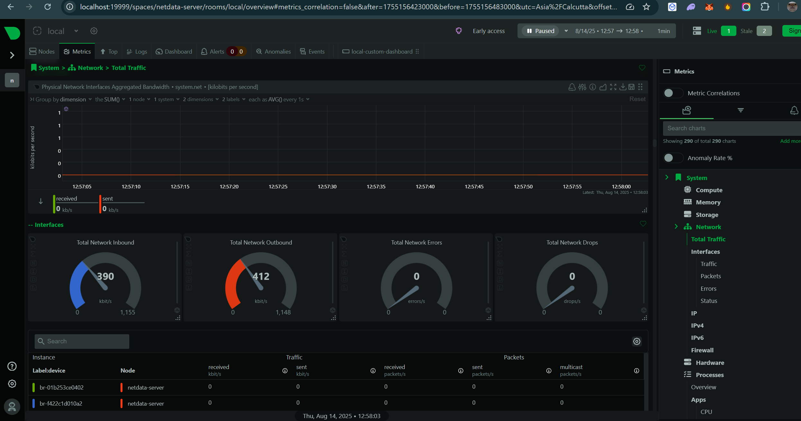
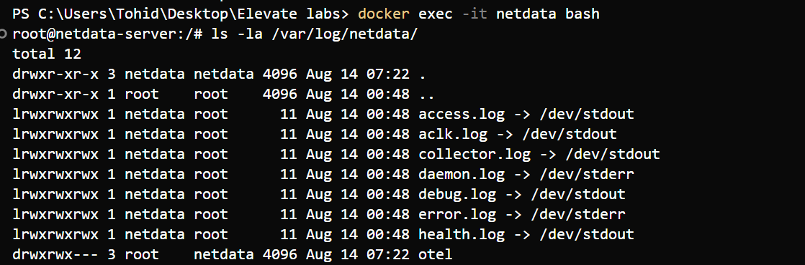

# Task 7: Monitor System Resources Using Netdata

## Objective
Install Netdata and visualize system and app performance metrics.

## Tools
- Netdata (free, open-source monitoring tool)
- Docker

## Deliverables
- Screenshot of the dashboard and running metrics

## About Netdata

Netdata is a free, open-source, real-time performance monitoring tool that provides comprehensive insights into system and application performance. It offers:

- **Real-time monitoring** with sub-second response times
- **Zero configuration** - works out of the box
- **Low resource usage** - minimal impact on system performance
- **Comprehensive metrics** - CPU, memory, disk, network, and more
- **Beautiful dashboards** - intuitive web interface
- **Docker integration** - monitors containers automatically

## What You'll Learn

- How to deploy monitoring tools using Docker
- Interpreting system performance metrics
- Monitoring Docker containers and applications
- Understanding the importance of system monitoring
- Working with real-time monitoring dashboards

## Expected Outcomes

After completing this task, you should:
- ✅ Understand how to deploy monitoring tools using Docker
- ✅ Be able to interpret system performance metrics
- ✅ Know how to monitor Docker containers and applications
- ✅ Understand the importance of system monitoring in production environments
- ✅ Be familiar with real-time monitoring dashboards

## Screenshots Captured

### 1. Main Dashboard Overview

*Overall system health and performance dashboard showing real-time metrics*

### 2. CPU Metrics

*Real-time CPU usage across all cores with detailed performance metrics*

### 3. Memory Usage

*RAM usage, swap utilization, and memory pressure indicators*

### 4. Disk I/O Performance

*Storage read/write operations, disk space, and I/O latency monitoring*

### 5. Network Statistics

*Network traffic, bandwidth usage, and connection statistics*

### 6. System Logs

*Netdata application logs showing system monitoring activities*

## Additional Resources

- [Netdata Documentation](https://docs.netdata.cloud/)
- [Netdata GitHub Repository](https://github.com/netdata/netdata)
- [Docker Monitoring Best Practices](https://docs.docker.com/config/daemon/monitoring/) 