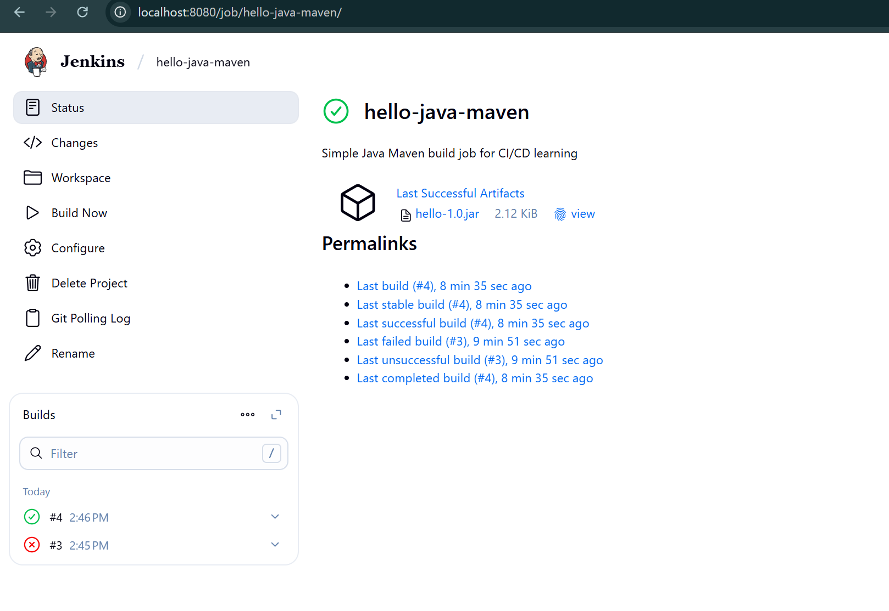
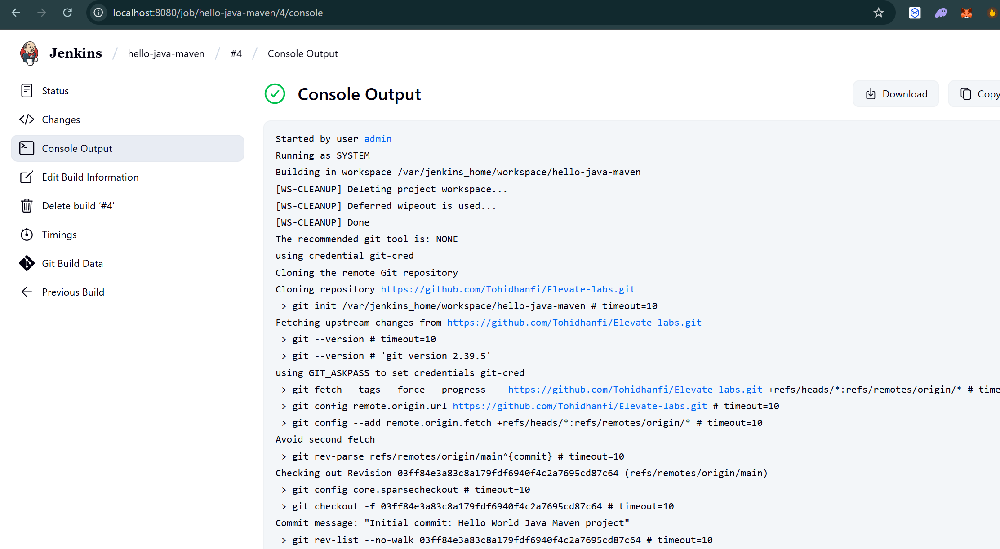
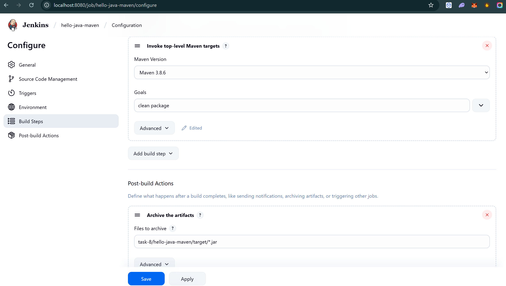
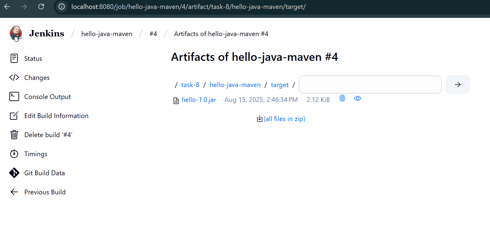
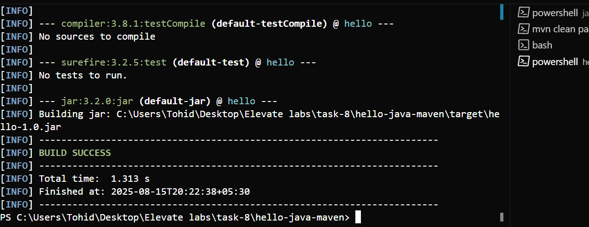

# Task 8: Run a Simple Java Maven Build Job in Jenkins

## Objective

Learn how to use Jenkins to build a simple Java application using Maven — your first step into CI/CD.

## 🛠 Tools Required (All Free)

- **Jenkins** (installed locally or via Docker)
- **Java JDK 8 or 11**
- **Maven**
- **Git** (optional — can run from local folder)

## 📂 Deliverables

- A basic Java HelloWorld app (with pom.xml)
- Jenkins Freestyle job configured to build it
- Screenshot of successful build console output

## 📦 Sample Dataset/Repo

**Repo name:** `hello-java-maven`

**Contents:**
- `src/main/java/HelloWorld.java`
- `pom.xml`

## 🧭 Step-by-Step Guide

### 1. Create a Java Application

Create the following file structure:
```
hello-java-maven/
├── src/
│   └── main/
│       └── java/
│           └── HelloWorld.java
└── pom.xml
```

#### HelloWorld.java
```java
public class HelloWorld {
    public static void main(String[] args) {
        System.out.println("Hello, Jenkins + Maven!");
    }
}
```

#### pom.xml
```xml
<project>
    <modelVersion>4.0.0</modelVersion>
    <groupId>com.example</groupId>
    <artifactId>hello</artifactId>
    <version>1.0</version>
    
    <build>
        <plugins>
            <plugin>
                <groupId>org.apache.maven.plugins</groupId>
                <artifactId>maven-compiler-plugin</artifactId>
                <version>3.8.1</version>
                <configuration>
                    <source>1.8</source>
                    <target>1.8</target>
                </configuration>
            </plugin>
        </plugins>
    </build>
</project>
```

### 2. Start Jenkins

Use Docker to run Jenkins:
```bash
docker run -p 8080:8080 jenkins/jenkins:lts
```

### 3. Configure Jenkins

1. **Access Jenkins:** Open browser and go to `http://localhost:8080`
2. **Get initial admin password:** Check Docker logs or initial setup page
3. **Install suggested plugins** during first-time setup

### 4. Configure Maven in Jenkins

1. Go to **Manage Jenkins** → **Global Tool Configuration**
2. Add **Maven** (e.g., Maven 3.8.6)
3. Set Maven installation path or let Jenkins install automatically
4. **Save** the configuration

### 5. Create Jenkins Job

1. **Create a new Freestyle project**
   - Click **New Item**
   - Enter project name: `hello-java-maven`
   - Select **Freestyle project**
   - Click **OK**

2. **Configure Source Code Management**
   - Select **None** (for local files)
   - Or use **Git** if you have a repository

3. **Configure Build Section**
   - Click **Add build step**
   - Select **Invoke top-level Maven targets**
   - Set **Goals:** `clean package`
   - Select your configured Maven installation

4. **Save the job**

### 6. Build the Job

1. Click **Build Now** to trigger the build
2. Monitor the build progress
3. Click on the build number to view details
4. Click **Console Output** to see the build logs


## 🎯 Learning Outcomes

After completing this task, you'll understand:

- **What a Jenkins job is** and how to create one
- **How to trigger builds manually** and monitor their progress
- **How Jenkins uses Maven** to compile Java code
- **How to read and understand console output** for debugging
- **Basic CI/CD concepts** and workflow

## 📸 Screenshots from Task

Below are the screenshots demonstrating the successful completion of Task 8 - Running a Simple Java Maven Build Job in Jenkins:

### 1. Jenkins Dashboard

*Jenkins main dashboard showing the `hello-java-maven` job with successful build status*

### 2. Successful Build Console Output

*Console output showing successful Maven build with BUILD SUCCESS message*

### 3. Job Configuration Page

*Jenkins job configuration showing Git repository, Maven build steps, and artifact archiving*

### 4. Build Artifacts

*Generated JAR file (hello-1.0.jar) in the build artifacts section*

### 5. Local Maven Build Test

*Local terminal showing successful `mvn clean package` command execution*

## ✅ Task Completion Summary

This task has been successfully completed with the following achievements:

- ✅ **Java and Maven** installed and configured locally
- ✅ **Jenkins** running successfully via Docker container
- ✅ **Git repository** created with proper source code structure
- ✅ **Jenkins job** configured with Git SCM and Maven build steps
- ✅ **Successful Maven build** executed in Jenkins with BUILD SUCCESS
- ✅ **JAR file** generated and archived as build artifact
- ✅ **All required screenshots** captured and documented
- ✅ **CI/CD pipeline** successfully implemented and tested

## 🎯 Learning Outcomes Achieved

Through this task, I have successfully learned and demonstrated:

- **Jenkins job creation and configuration**
- **Maven build automation in CI/CD**
- **Git integration with Jenkins**
- **Build artifact management**
- **Console output analysis and troubleshooting**
- **Basic CI/CD pipeline concepts and workflow**

## 🔧 Troubleshooting

### Common Issues:

1. **Maven not found:** Ensure Maven is properly configured in Global Tool Configuration
2. **Java compilation errors:** Check Java version compatibility in pom.xml
3. **Permission issues:** Ensure Jenkins has access to the project directory
4. **Port conflicts:** Change Jenkins port if 8080 is already in use

### Useful Commands:

```bash
# Test Maven locally before Jenkins
mvn clean package

# Check Java version
java -version

# Check Maven version
mvn -version
```

## 📚 Additional Resources

- [Jenkins Official Documentation](https://www.jenkins.io/doc/)
- [Maven Getting Started Guide](https://maven.apache.org/guides/getting-started/)
- [Jenkins Pipeline Tutorial](https://www.jenkins.io/doc/book/pipeline/)

---

**Note:** This task serves as a foundation for more complex CI/CD pipelines. The concepts learned here will be essential for future tasks involving automated testing, deployment, and continuous integration. 